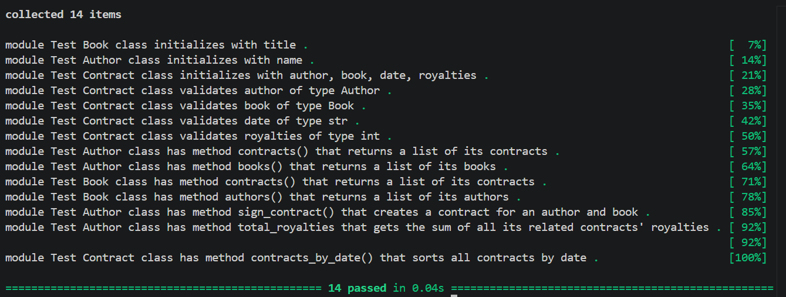

# Many-to-Many Relationships Lab: Book Contracts

## Overview

This project demonstrates a many-to-many relationship in Python using three classes:

* `Author`
* `Book`
* `Contract`

Authors can have multiple books through contracts, and books can have multiple authors through contracts.

The `Contract` class acts as the join model that connects Authors and Books while storing additional information such as contract date and royalties.

---

## Project Structure

```text
.
├── many_to_many.py
├── lib/
├── tests/
└── README.md
```

---

## Classes

### Author

Represents an author who can sign contracts for books.

#### Attributes

* `name`
* `all`

#### Methods

* `contracts()`
* `books()`
* `sign_contract(book, date, royalties)`
* `total_royalties()`

---

### Book

Represents a book that can be associated with multiple authors.

#### Attributes

* `title`
* `all`

#### Methods

* `contracts()`
* `authors()`

---

### Contract

Represents the relationship between an Author and a Book.

#### Attributes

* `author`
* `book`
* `date`
* `royalties`
* `all`

#### Methods

* `contracts_by_date(date)`

---

## Example Usage

```python
author = Author("George Orwell")
book = Book("1984")

contract = author.sign_contract(
    book,
    "01/01/2024",
    50000
)

print(author.books())
print(book.authors())
print(author.total_royalties())
```

---

## Running Tests

Run the test suite with:

```bash
pytest
```

Expected result:

```bash
=========================
All tests passed
=========================
```

---

## Screenshot

Add a screenshot of your passing test suite in the project.

Create a folder called `assets` and save your screenshot as:

```text
assets/tests-passing.png
```

Then reference it below:



---

## Concepts Demonstrated

* Object-Oriented Programming (OOP)
* Many-to-Many Relationships
* Class Attributes
* Instance Methods
* Property Validation
* Data Modeling in Python

---

## Author

Created as part of the Many-to-Many Relationships Book Contracts Lab.

